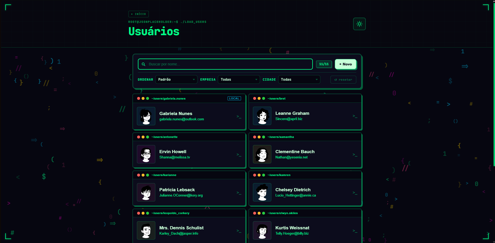
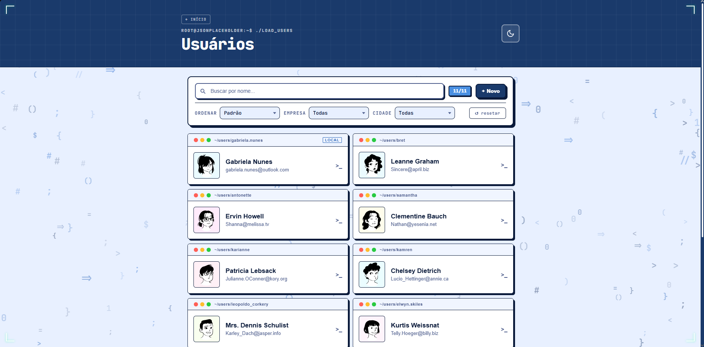
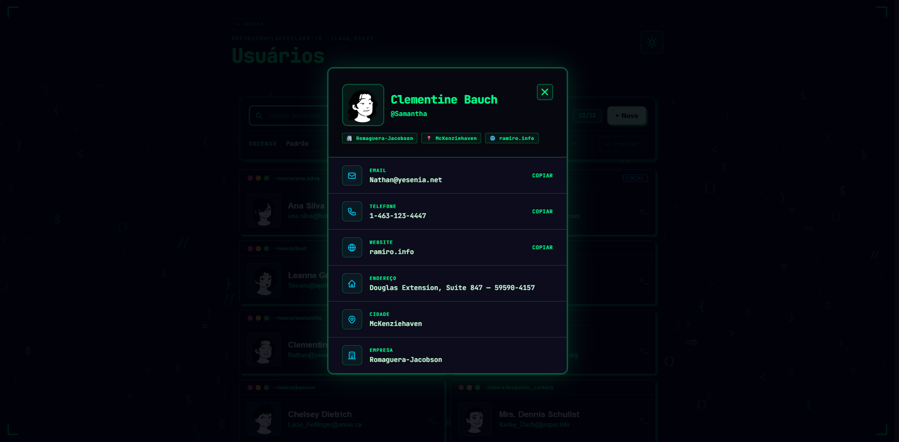
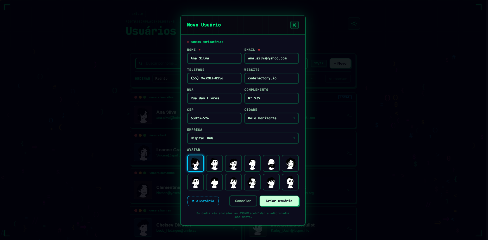
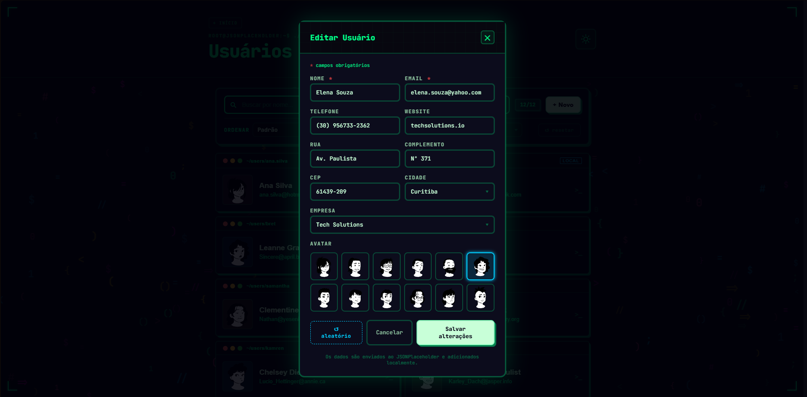

<div align="center">

# 🌐 User Explorer

**Aplicação React para listagem e gerenciamento de usuários com design system próprio**

[](https://react.dev)
[](https://www.typescriptlang.org)
[](https://vitejs.dev)
[](https://styled-components.com)
[](https://vitest.dev)

</div>

---


---

## ✨ Funcionalidades

| Feature | Descrição |
|---|---|
| 📋 **Listagem** | Cards de usuários vindos da JSONPlaceholder API |
| 🔍 **Busca com debounce** | Filtragem em tempo real com ordenação alfabética automática |
| 🏷️ **Filtros** | Por empresa e cidade, com reset rápido |
| 🔃 **Ordenação** | Por nome (A→Z, Z→A) e empresa |
| 🪟 **Modal de detalhes** | Copy-to-clipboard para email, telefone e website |
| ➕ **Criação de usuários** | Formulário validado com avatar personalizável |
| ✏️ **Edição de usuários** | Formulário pré-preenchido para editar usuários locais |
| 🗑️ **Deleção com confirmação** | Confirmação inline antes de remover |
| 💾 **Persistência local** | Usuários criados sobrevivem ao reload via `localStorage` |
| 🔔 **Toast notifications** | Feedback visual para todas as ações |
| 🌙 **Tema dark/light** | Alternância animada com persistência no `localStorage` |
| ✨ **Splash screen** | Tela de boas-vindas com partículas interativas em canvas |
| ⏳ **Skeleton loading** | Estado de carregamento com cards animados |
| ❌ **Estado de erro** | Retry automático em caso de falha na API |
| 🈳 **Empty state** | Feedback visual quando a busca não retorna resultados |
| 📱 **Responsivo** | Layout funcional a partir de 320px |

---

## 🖼️ Screenshots

| Tema Dark | Tema Light |
|---|---|
|  |  |

| Modal de detalhes | Formulário de criação |
|---|---|
|  |  |

| Edição de usuário |
|---|
|  |

---

## 🚀 Como rodar

### Pré-requisitos

- Node.js 18+
- npm 9+

### Instalação

```bash
# Clone o repositório
git clone https://github.com/BanjoInertia/desafio-tecnico-API.git

# Entre na pasta
cd desafio-tecnico-API

# Instale as dependências
npm install

# Rode em modo desenvolvimento
npm run dev
```

A aplicação estará disponível em `http://localhost:5173`.

### Scripts disponíveis

```bash
npm run dev        # Servidor de desenvolvimento com HMR
npm run build      # Build de produção (saída em /dist)
npm run preview    # Preview local do build de produção
npm test           # Roda os testes uma vez
npm run test:watch # Testes em modo watch
```

---

## 🧪 Testes

64 testes cobrindo hooks, componentes e contextos com **Vitest** + **React Testing Library**.

```bash
npm test
```

Cobertura inclui:
- `useUsers` — fetch, merge com `localStorage`, estados de loading/error
- `useDebounce` — delay e cancelamento de timer
- `useFocusTrap` — navegação por teclado dentro de modais
- `ThemeContext` e `ToastContext` — comportamento dos providers
- `SearchBar`, `UserCard`, `UserModal`, `AddUserModal` — interações e renderização condicional

---

## 🏗️ Estrutura do projeto

```
src/
├── components/
│   ├── AddUserModal.tsx     # Formulário de criação com validação
│   ├── Combobox.tsx         # Input com sugestões (cidade/empresa)
│   ├── ErrorState.tsx       # Estado de erro com retry
│   ├── LoadingState.tsx     # Skeleton cards de carregamento
│   ├── ParticleCanvas.tsx   # Canvas com partículas interativas
│   ├── SearchBar.tsx        # Busca com clear button
│   ├── SelectDropdown.tsx   # Dropdown customizado
│   ├── SplashScreen.tsx     # Tela de boas-vindas animada
│   ├── Toast.tsx            # Notificações temporárias
│   ├── UserCard.tsx         # Card de usuário na listagem
│   └── UserModal.tsx        # Modal de detalhes e deleção
├── context/
│   ├── ThemeContext.tsx     # Tema dark/light com persistência
│   └── ToastContext.tsx     # Fila de toasts global
├── hooks/
│   ├── useBodyScrollLock.ts # Trava scroll do body ao abrir modais
│   ├── useDebounce.ts       # Debounce para busca
│   ├── useFocusTrap.ts      # Foco preso dentro de modais (a11y)
│   └── useUsers.ts          # Fetch da API + merge com localStorage
├── services/
│   └── api.ts               # Camada de comunicação com JSONPlaceholder
├── styles/
│   ├── GlobalStyle.ts       # Reset e estilos globais
│   └── theme.ts             # Tokens de cor para dark e light
├── test/                    # Testes unitários e de integração
└── types/
    └── user.ts              # Tipagem do modelo User
```

---

## 🛠️ Stack

| Camada | Tecnologia |
|---|---|
| Framework | React 19 |
| Linguagem | TypeScript 6 |
| Build | Vite 8 |
| Estilização | styled-components 6 |
| Testes | Vitest + React Testing Library |
| Linting | Oxlint |
| API | [JSONPlaceholder](https://jsonplaceholder.typicode.com) |

---

## 🧠 Decisões técnicas

**Sem bibliotecas de UI**
Todos os componentes foram construídos do zero com styled-components. A decisão garante controle total sobre o design system e demonstra domínio de CSS sem abstração de terceiros.

**CRUD completo para usuários locais**
Usuários criados localmente suportam criação, leitura, edição e deleção (com confirmação). O hook `useUsers` combina esses dados com os da API em uma única lista tipada, mantendo a separação via badge `LOCAL`. Usuários da API são somente leitura, refletindo o comportamento real do JSONPlaceholder.

**Tema como contexto global**
A troca de tema é feita via `ThemeContext` integrado ao `ThemeProvider` do styled-components. Todos os tokens de cor são reativos sem prop drilling e persistem entre sessões.

**Acessibilidade desde o início**
Modais com `role="dialog"`, `aria-modal`, `aria-label` e foco preso via `useFocusTrap`; ícones decorativos com `aria-hidden`; loading state com `role="status"`. Navegação por teclado funcional em todos os componentes interativos.

**Debounce na busca**
O hook `useDebounce` evita filtragens desnecessárias a cada keystroke, melhorando a performance percebida em listas grandes.

---
